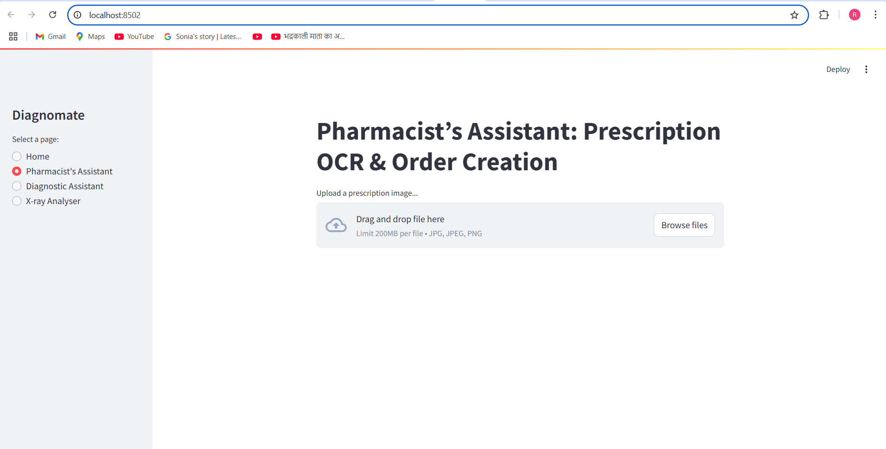
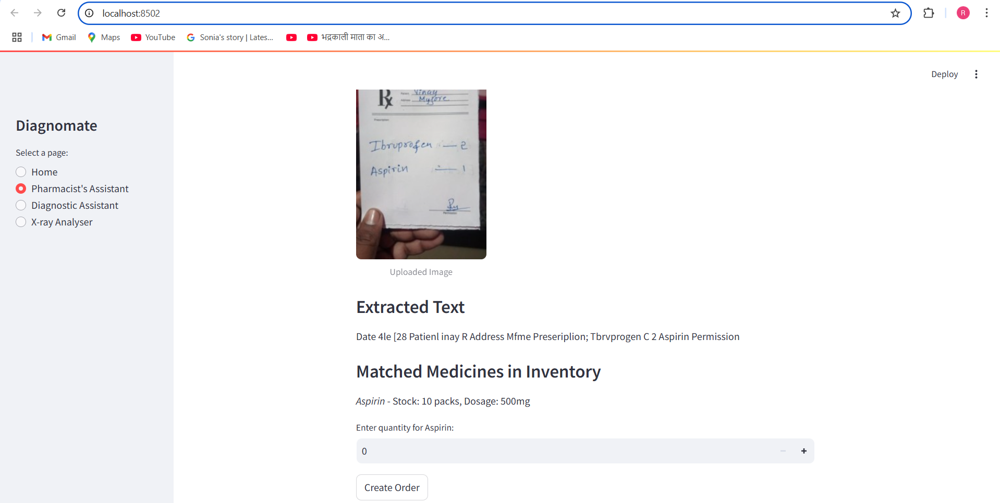
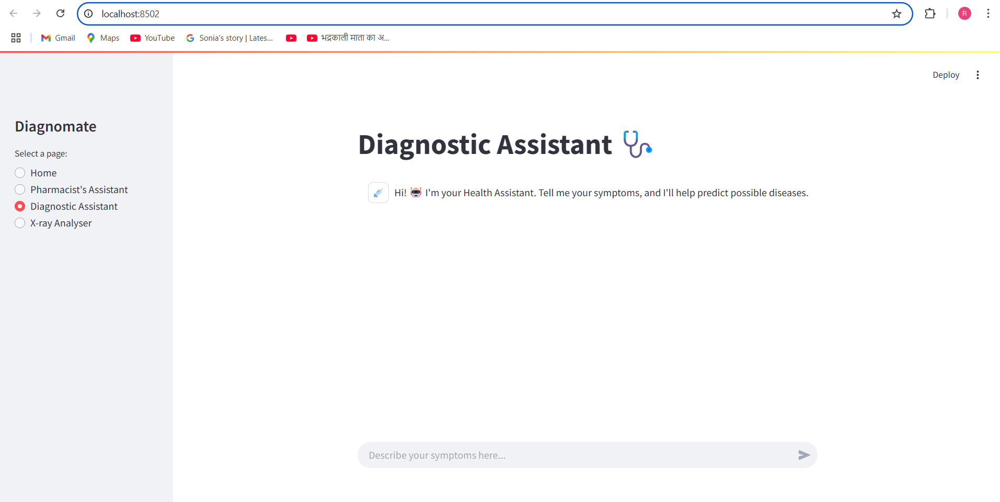
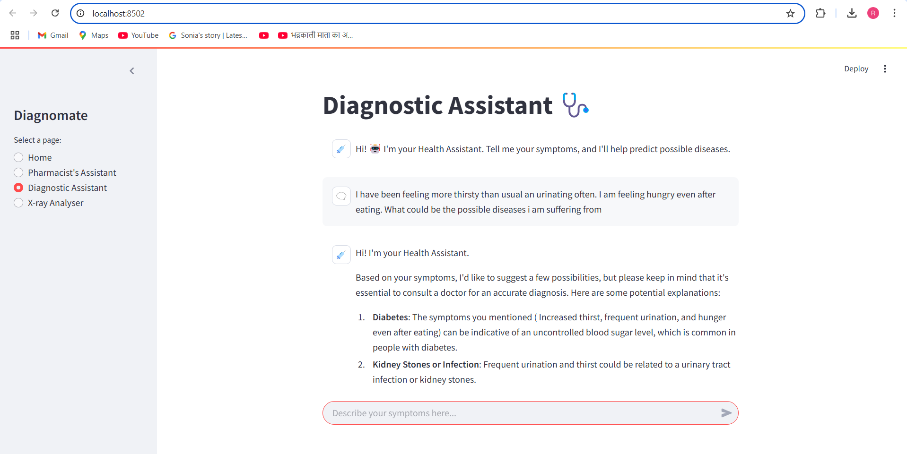
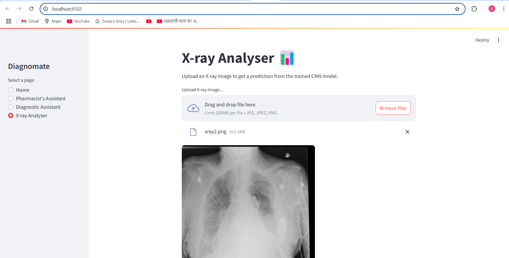
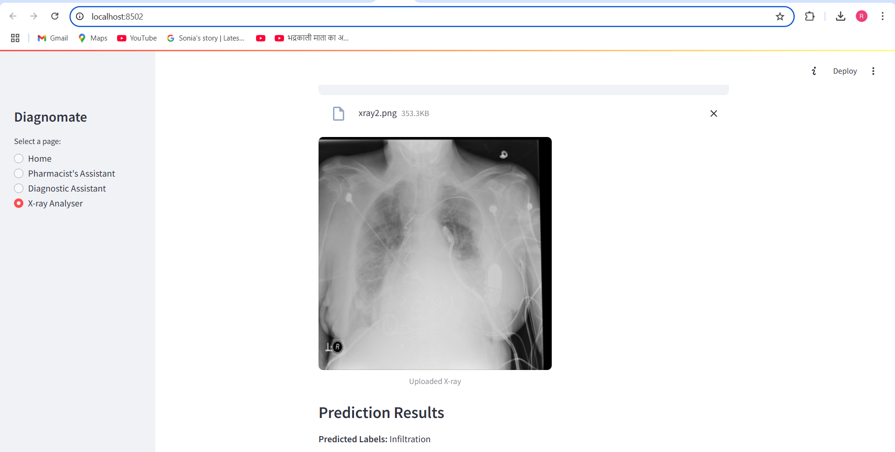

# Diagnomate: Your AI Health Diagnostic Companion

DiagnoMate is an AI-driven medical report analysis solution designed to streamline healthcare documentation and improve patient diagnostics. The platform utilizes **Optical Character Recognition (OCR)**, **Natural Language Processing (NLP)**, **Convolutional Neural Network(CNN)** to extract, analyze, and interpret information from medical reports, prescriptions, and diagnostic documents. By automating report processing, DiagnoMate enhances efficiency in healthcare workflows, reduces manual errors, and enables faster decision-making for doctors and patients

## Solution Approach

1️) **Pharmacist’s Assistant**

Pharmacists often struggle with illegible handwriting on prescriptions and manual stock verification, leading to errors and delays. The system extracts medicine information from prescription images using **OCR (EasyOCR)** and image preprocessing techniques **(OpenCV)** like grayscale conversion, **CLAHE**, and adaptive thresholding to enhance text clarity. Recognized medicine names are matched with the inventory database using string matching and heuristics, allowing pharmacists to quickly verify stock availability and generate orders, reducing human errors and improving efficiency.

2️) **Diagnostic Assistant**

Many individuals lack immediate access to healthcare professionals and struggle with self-diagnosis due to vague symptom descriptions. This AI-powered chatbot leverages **LLM (Llama3-8b-8192)** for natural language understanding and symptom interpretation. Prompt engineering ensures medically relevant responses, while session management maintains conversation flow for multi-turn dialogues. The chatbot provides instant health insights and preliminary guidance, bridging the gap between users and professional healthcare advice.

3️) **X-ray Analyser**

Manual X-ray analysis is time-consuming and prone to human errors, potentially delaying critical diagnoses. The system automates X-ray diagnosis using deep learning-based image classification models. It preprocesses medical images and applies **CNN-based architectures** to detect abnormalities, reducing diagnostic errors and accelerating early disease detection, ultimately assisting radiologists in making faster and more accurate decisions.
## Results
## Pharmacist's Assistant
### AI Techniques & Algorithms Used

### 1. Image Preprocessing (OpenCV)
- **Grayscale Conversion**: Reduces complexity by removing color information.  
- **Gaussian Blur**: Smooths the image to reduce noise, enhancing text clarity.  
- **CLAHE (Contrast Limited Adaptive Histogram Equalization)**: Boosts local contrast, making faint handwriting or printed text more readable.  
- **Adaptive Thresholding**: Separates text from the background by creating a binary image.  
- **Morphological Operations (Opening)**: Removes small noise elements and connects broken text segments.  

### 2. OCR (Optical Character Recognition) — EasyOCR
- **Transforms the preprocessed image into machine-readable text.**  
- **Technique Used**: Deep learning-based text detection and recognition (CRNN — Convolutional Recurrent Neural Networks combined with CTC loss).  

### 3. Text Matching & Inventory Mapping
- **String Matching**: Compares OCR-extracted text with entries in the `MEDICINE_INVENTORY` using case-insensitive matching.  

## Diagnostic Assistant

### AI Techniques & Algorithms Used:
1. **Large Language Model (LLM) – LLaMA3-8B-8192**
   - Used for natural language understanding and contextual response generation.
   - It interprets user-described symptoms and generates relevant diagnostic insights.

2. **Prompt Engineering**
   - `CHAT_CONTEXT` and `INITIAL_RESPONSE` guide the LLM to stay focused on health diagnostics.
   - The prompt chain ensures the assistant offers medically relevant responses.

3. **Session Management (`st.session_state`)**
   - Maintains conversation history for continuity, enabling multi-turn dialogues where past inputs influence future responses.

4. **Streaming API (`stream=True`)**
   - Provides real-time responses, improving user engagement by showing the assistant "typing" effect.

### Result:
  
  

---

## X-ray Analyser

### AI Techniques & Algorithms Used:
1. **Convolutional Neural Networks (CNNs)**
   - **Purpose:** Image classification and feature extraction.
   - **How It Helps:** CNN layers detect patterns like edges, shapes, and anomalies in X-ray images.

2. **Transfer Learning (FastAI – ResNet-50)**
   - **Purpose:** Uses pre-trained models fine-tuned on medical images.
   - **How It Helps:** Speeds up training and improves accuracy with limited medical data.
   - **Dataset:** Trained on the **NIH Chest X-ray dataset**, labeled with 14 disease categories.

### Result:
  
  

## Deployment
🔗 **Use deployed app to check Diagnomate:** [https://diagno-mate.streamlit.app/](https://diagno-mate-bcgylvzusakwh9jb57nrsg.streamlit.app/)

## Run it in your local machine:
1. Clone the repository to your local machine: `git clone https://github.com/your-username/diagnomate.git` 
2. Set Up a Virtual Environment. Run the following command
   `python -m venv venv`
  
   On macOS/Linux:
   `source venv/bin/activate`
   
   On Windows:
   `venv\Scripts\activate`

3. Install the necessary dependencies and libraries as specified in the documentation.
4. Install requirements for streamlit app
`pip install -r requirements.txt`

5. Set up the environment and configure the solution parameters according to your requirements.
6. Get Your GROQ_API_KEY from https://groq.com/

7. Create a .env file in the project root directory and add your API key (replace your_api_key_here with your actual API key):
`GROQ_API_KEY=your_api_key_here`

8. To Check results for Victim Detection in Floods
` streamlit run temp.py`
